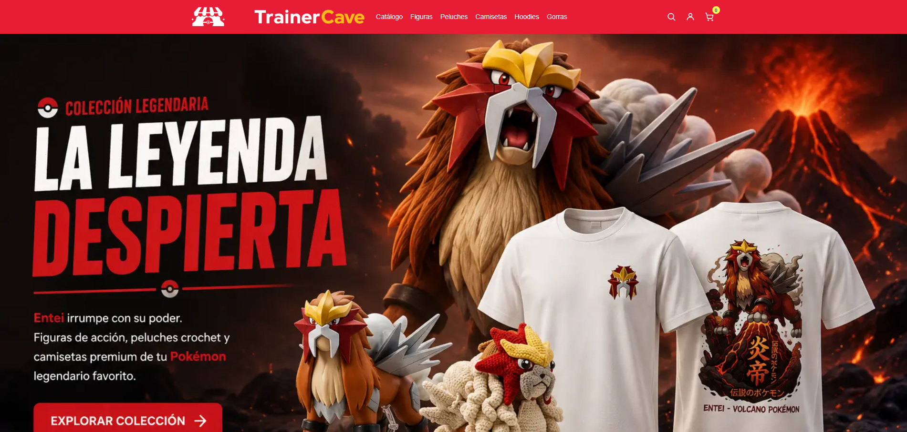
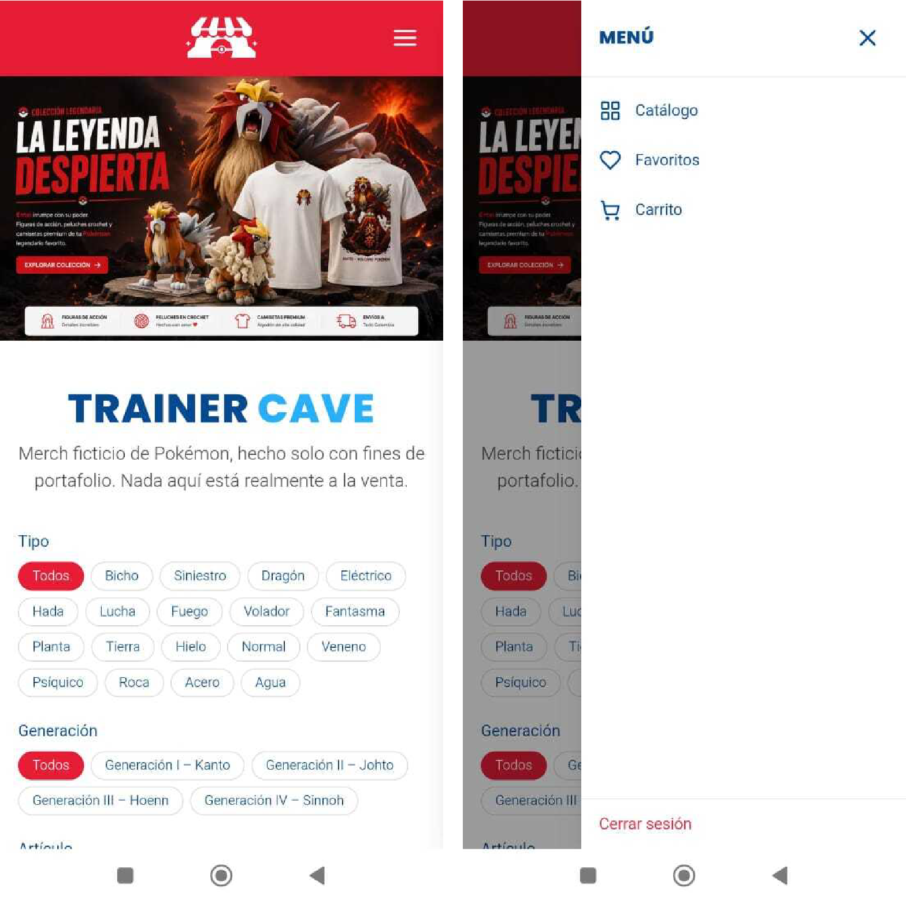
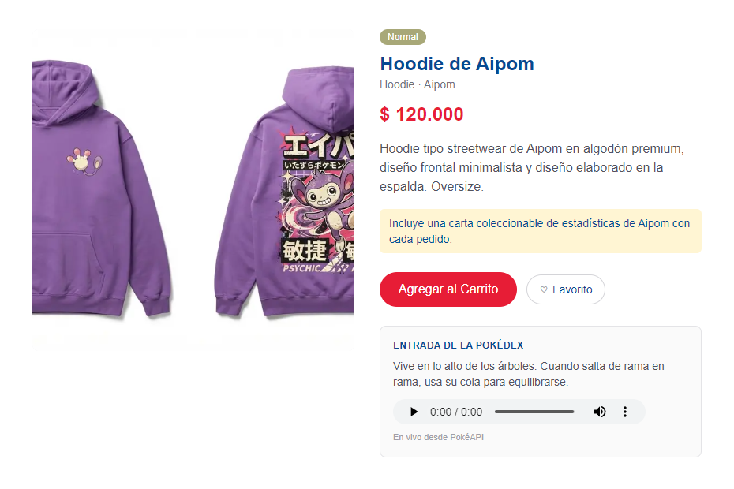
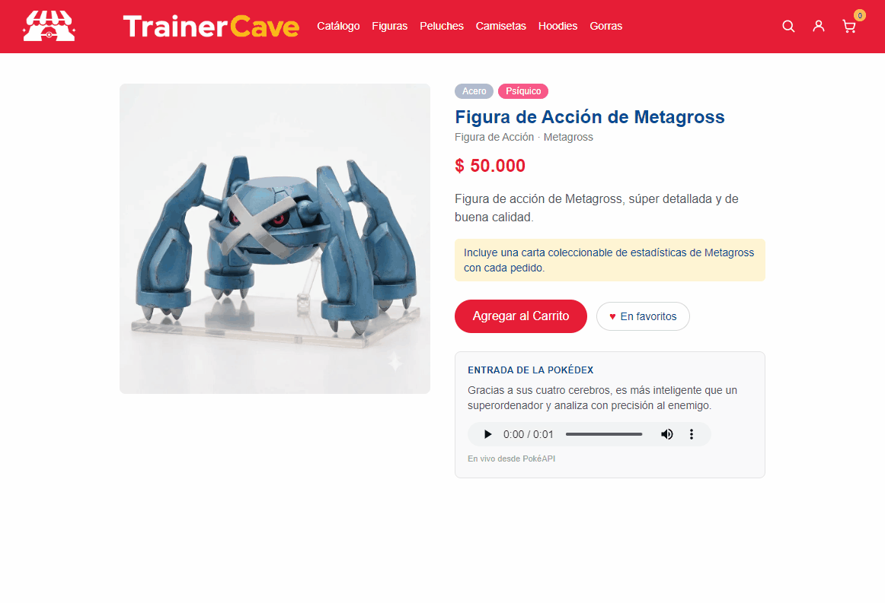
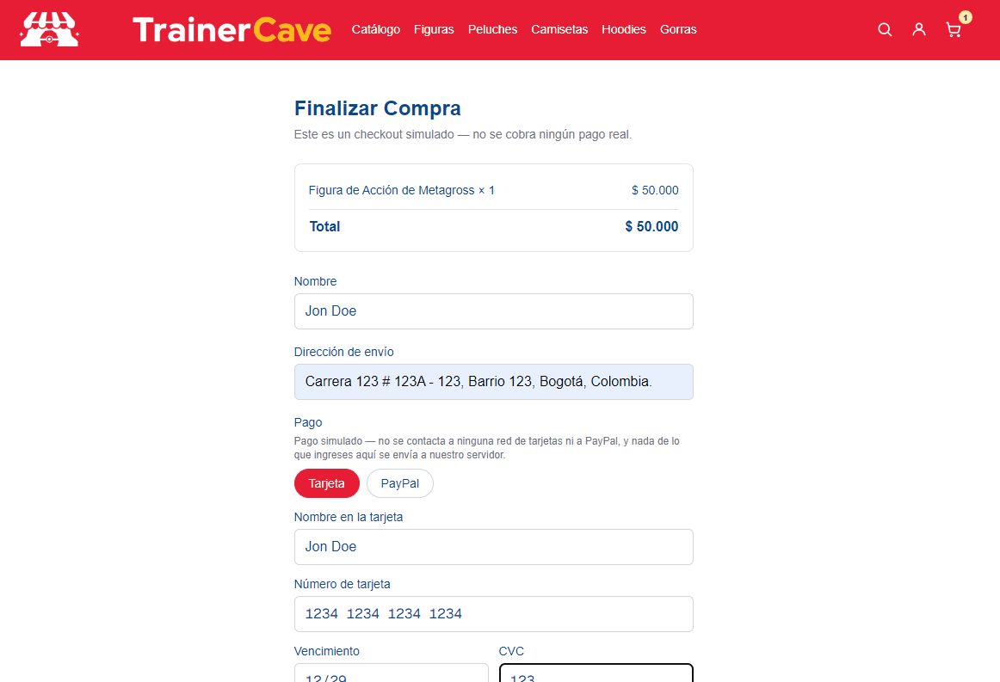

# Trainer Cave

> **Portfolio project — not a real store.** Trainer Cave is a fictional
> e-commerce site built purely to demonstrate full-stack web development
> skills. No real products are sold and no real payments are processed
> anywhere in this app.
>
> Pokémon and all related names, images, and data are trademarks of
> Nintendo, Game Freak, and The Pokémon Company. This project is an
> unofficial fan project, not affiliated with or endorsed by them.
> Pokémon reference data is sourced from the public
> [PokéAPI](https://pokeapi.co/).

## Demo

Live at **[trainer-cave.vercel.app](https://trainer-cave.vercel.app)**.

## Screenshots

| Catalog (desktop) | Mobile nav |
| --- | --- |
|  |  |

| Product detail | Collectible card flip |
| --- | --- |
|  |  |

**Checkout**

| Step 1 | Step 2 |
| --- | --- |
|  |  |

## What this is

A Pokémon-themed merch storefront (action figures, crochet plushies,
apparel) with a browsable/filterable catalog, product pages, a
localStorage-backed cart, a simulated checkout flow, user accounts with
favorites, and an admin panel for managing the catalog — built to show
off frontend, backend, database, and external API integration in one
project.

## Tech stack

- [Next.js](https://nextjs.org) (App Router, TypeScript) — frontend and
  backend (Server Components, Route Handlers)
- [Tailwind CSS v4](https://tailwindcss.com) — styling
- [Supabase](https://supabase.com) — Postgres database, Auth, and
  Storage, with Row Level Security on every table
- [PokéAPI](https://pokeapi.co/) — Pokémon reference data (species,
  types, stats, sprites), synced at seed time; product pages also make
  a live request for Pokédex flavor text and cry audio
- [Vercel](https://vercel.com) — deployment

## Architecture

- **Catalog data** (Pokémon, types, generations, article types,
  products) lives in Supabase Postgres, seeded from PokéAPI plus this
  repo's own product data — see `supabase/seed/`.
- **Cart** is client-side (`localStorage`) for guests; logged-in users
  get it persisted server-side in `cart_items`.
- **Checkout** is entirely simulated — it writes a real `orders` /
  `order_items` row to demonstrate an actual backend write, but no
  payment is ever processed.
- **Admin panel** (`/admin`) lets a promoted admin user manage products
  without touching SQL, gated by Supabase Auth + RLS.

## Local setup

1. Install dependencies:

   ```bash
   npm install
   ```

2. Copy `.env.local.example` to `.env.local` and fill in your Supabase
   project's URL and anon key (`NEXT_PUBLIC_SUPABASE_URL`,
   `NEXT_PUBLIC_SUPABASE_ANON_KEY`). The `SUPABASE_SERVICE_ROLE_KEY` is
   only needed if you plan to run the seed script yourself — grab it
   from your Supabase project's **Settings > API** page. It's never
   used outside `supabase/seed/`.

3. Apply the migrations in `supabase/migrations/` to your Supabase
   project, in order (via the Supabase SQL editor, CLI, or MCP).

4. Seed reference + catalog data:

   ```bash
   npm run seed
   ```

   This pulls Pokémon data from PokéAPI and uploads product images from
   `supabase/seed/images/` (not committed to this repo — see
   `supabase/seed/products.ts` for the product list).

5. Run the dev server:

   ```bash
   npm run dev
   ```

## Deployment

Deployed on Vercel, connected to this repo's `main` branch. Set
`NEXT_PUBLIC_SUPABASE_URL` and `NEXT_PUBLIC_SUPABASE_ANON_KEY` as
Vercel project environment variables — the service role key is never
needed at runtime and should never be added there.

## Challenges

- **Next.js 16 breaking changes.** Several conventions differ from what
  most docs/training data assume — `middleware.ts` was renamed to
  `proxy.ts`, and `searchParams`/`cookies()` are now async. Solved by
  reading the framework's own bundled docs before writing routing/auth
  code instead of assuming prior knowledge still applied.
- **Tailwind v4 silently dropping transform utilities.** Arbitrary-value
  classes like `scale-x-125` and `[transform:rotateY(180deg)]` didn't
  apply as expected — Tailwind v4 sets discrete `scale`/`rotate`
  properties instead of composing them into the legacy `transform`
  shorthand, which broke the collectible card's 3D flip animation.
  Fixed by moving those specific styles to inline React `style` props.
- **Device-dependent dark mode.** Tailwind v4 generates its own
  `prefers-color-scheme: dark` media query for every `dark:` utility,
  completely independent of this app's own theme variables — so the
  site rendered with different backgrounds on phone vs. PC depending on
  system theme. Fixed by switching Tailwind's dark-mode strategy to a
  class that's never applied, forcing one consistent look everywhere.
- **Filtering from the header didn't scroll to the results.** Clicking
  a category or searching correctly filtered the catalog, but the page
  stayed scrolled at the top, still showing the hero banner instead of
  jumping to the results grid. Root cause: Next.js's built-in scroll-to
  `#hash` behavior doesn't reliably fire on same-route,
  searchParams-only navigations. Fixed with a small client component
  that detects the `#catalogo` hash and calls `scrollIntoView({
  behavior: "smooth" })` itself.
- **Row Level Security errors leaking to guests.** Unauthenticated
  users attempting to check out saw a raw Postgres error ("new row
  violates row-level security policy"). Fixed with a client-side auth
  guard that shows a friendly "please log in" message and redirects
  back to checkout after login, instead of exposing the underlying
  database error.
- **Supabase email bounce-rate warning.** Repeated test signups with
  fake email addresses during development triggered a real bounce-rate
  warning from Supabase's email provider, since every `signUp()` call
  attempts to send a confirmation email regardless of whether the
  address is real. Diagnosed the cause, disabled forced email
  confirmation (reasonable for a non-commercial demo), and verified
  the fix with a real address.
- **Hero image feels disconnected from the page under browser zoom.**
  Using Ctrl+scroll (or Ctrl +/-) to zoom the page on desktop rescales
  the header, text, and product grid correctly, but the hero banner's
  raster image lagged behind and looked out of sync with the rest of
  the layout mid-zoom. The hero graphic was an unoptimized 2.3&nbsp;MB
  PNG, far heavier to decode/recomposite on every zoom step than the
  rest of the (mostly text/CSS) page — the image simply couldn't keep
  up. Fixed by re-exporting it as an optimized JPEG (the artwork has no
  transparency to lose), cutting it to ~230&nbsp;KB with no visible
  quality loss.
- **Ambiguous currency symbol.** Prices were shown with just the peso
  sign (e.g. `$ 60.000`), but `$` alone is used by dozens of
  currencies worldwide — nothing told a visitor this was specifically
  Colombian pesos. Fixed by appending the ISO code to every formatted
  price (`$ 60.000 COP`) in the single shared `formatPrice()` helper,
  so it's unambiguous everywhere prices appear without touching each
  call site individually.
- **Add to Cart was a one-way door.** Once added, the button turned
  into a disabled "Agregado ✓" label — undoing it meant navigating all
  the way to `/cart` and removing it there, which felt heavy for such
  a small correction, especially on a long catalog page. Fixed by
  making the button a real toggle (click again to remove) and adding
  a persistent floating cart button plus a "back to top" button, so
  managing the cart or returning to the top never costs your scroll
  position on a growing product list.

## Roadmap

- Swap the simulated payment form for a real payment gateway in test/
  sandbox mode (e.g. Stripe Checkout)
- Order history page for logged-in users
- Product reviews/ratings
- Pagination or infinite scroll for the catalog (currently loads every
  product at once)
- Evolution-line data on the back of the collectible cards
- Automated tests (unit + end-to-end)
- English/Spanish language toggle
